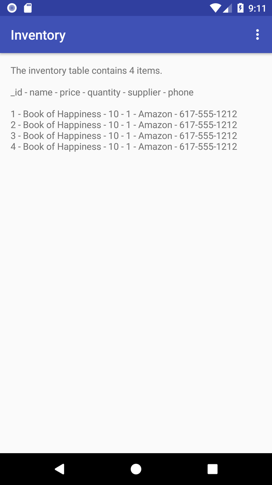

# Inventory
Android Studio project: Create an SQLite Database for an Inventory - Grow with Google Challenge Scholarship 2018

## Synopsis

Name: Inventory - Stage I

This is an example of creating an SQLite database for an inventory application.

<kbd></kbd>

## Code Description

An SQLite database is created with the following fields:  _ID, Product Name, Price, Quantity, Supplier Name, Supplier Phone.

## Motivation

This is the eight exercise in the "Grow with Google - Android Basic Development Nanodegree Scholarship 2018" program with Udacity.

## Installation

Project can be downloaded from GitHub:  https://github.com/hillc255/Inventory

## API Reference

## Tests (Future consideration!)

Describe and show how to run the tests with code examples.

## Contributors

Claudia Hill designed and developed this project.

## License

Only to be used for educational purposes.

